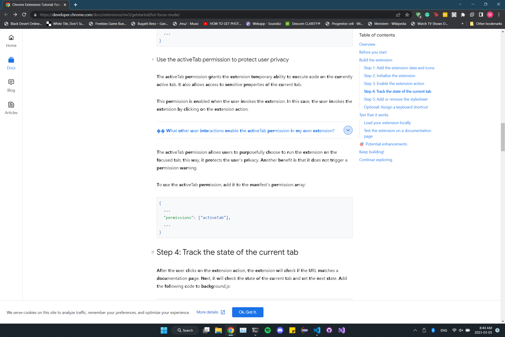

## NonWorking Websites

- Reddit

## Working Websites

- Wikipedia
- w3schools

## TODO

- Add on off button in extension window thingy
- use scripting permissions with chrome.scripting API to apply at runtime

# KNOWN ISSUES

- breaks hyperlink in wiki
  - confirm this is in other websites as well
- text images are broken in certain instances
  - 
